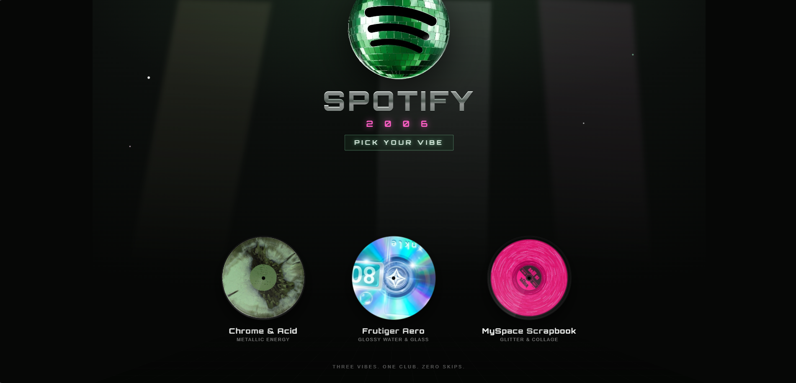

<h1 align="center">Spotify 2006</h1>

<p align="center">
  
</p>

<p align="center">
  <a href="https://spotify-drab-alpha.vercel.app/"><b>🔗 Live Demo</b></a>
</p>

<p align="center">
  
  
  
  
</p>

<p align="center">
  <b>What if Spotify had launched in 2006?</b><br>
  A hackathon rebuild that wraps a fully modern music player — real search, playback,
  playlists, and an AI DJ — in the design language of the mid-2000s web.<br>
  The <i>look</i> is Y2K; nothing else is faked.
</p>

---

## Overview

One React app, one music engine, **three completely different retro skins**. Each theme is its own visual world built against a shared theme contract, so the player, library, and AI DJ work identically no matter which one you pick — only the paint changes. Choose your vibe on the landing page and the whole app re-skins.

---

## The three themes

###  Chrome & Acid · `/chrome`
The flagship, most fully-featured build. A three-column metallic desktop shell channeling early-2000s skinned media players, in an acid-green palette. Includes a **light/dark "silver" skin toggle**, a boot sequence on first load, retro dialogs, a full DJ console, and dedicated mobile drawers.

###  Frutiger Aero · `/aero`
The glossy, optimistic "clean tech" look: translucent **liquid-glass panels** floating over a daytime sky, with drifting bubbles and blue-green gradients. Features an iPod-style **click-wheel widget**, a floating glass player bar, and **MixBuddy**, the AI DJ in chat-window form.

###  MySpace Scrapbook · `/scrapbook`
A handmade collage aesthetic: notebook-paper backgrounds, hard offset shadows, taped polaroids, glitter, and a period-accurate **56k-modem loading screen**. Playback runs through a scrapbook-styled iPod bar, with the same AI DJ in a stickered-widget skin.

**Every theme shares the same engine:** real search & playback over the live iTunes catalog, playlists ("Mix CDs"), likes & library that persist locally, and **DJ_Sp1n** — an AI DJ that watches what you play and builds you mixes.

---

## Tech stack

| Layer | Choice |
| --- | --- |
| **Framework** | React 19 |
| **Build tool** | Vite 8 |
| **Routing** | react-router-dom 7 — one route per theme |
| **State** | Zustand 5 — a single shared player/library store, exposed to themes only through hooks |
| **AI DJ** | Groq running `llama-3.3-70b-versatile` |
| **Catalog** | iTunes Search API — no key required |
| **Tooling** | oxlint, Vercel Analytics |

---

## Run it locally

```bash
cd react
npm install
npm run dev
```

The AI DJ needs a Groq key — add `VITE_GROQ_API_KEY=your_key` to `react/.env`. Everything else works without it.
